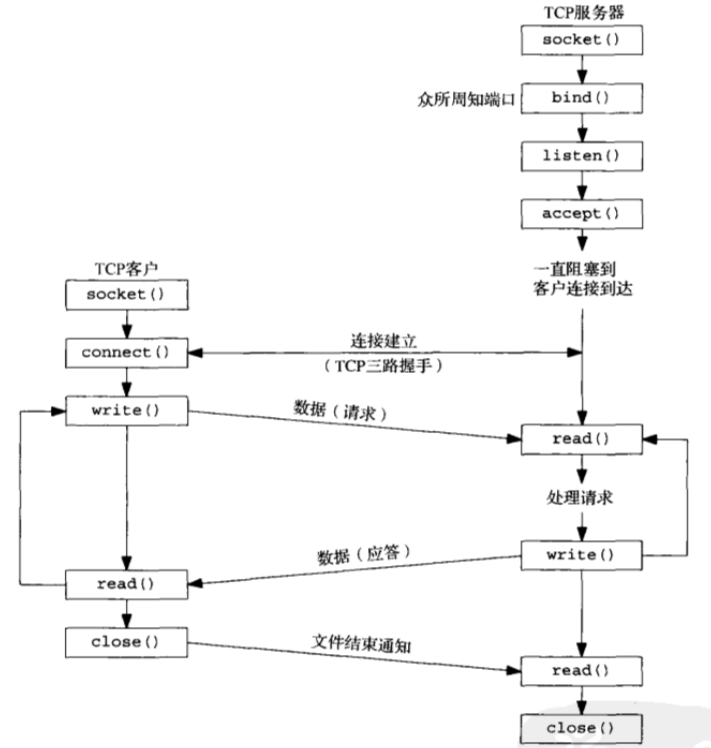
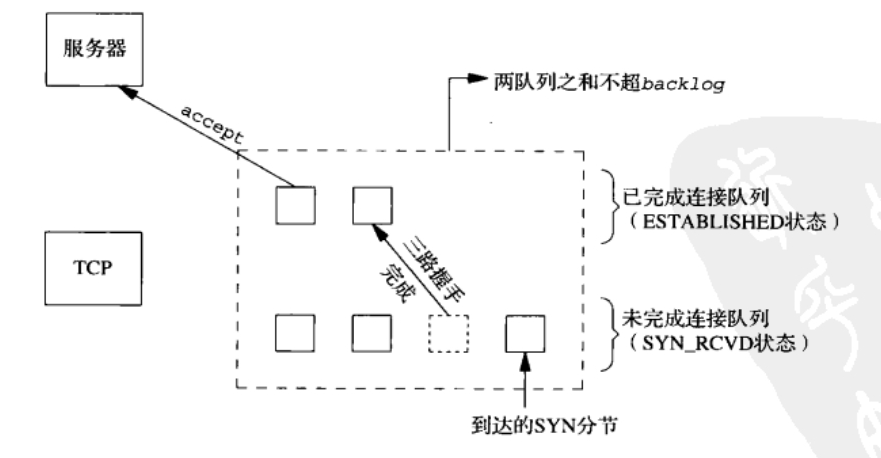

# UNIX Network Programming—Chapter 04 基本套接字编程

## 1. 函数调用顺序



## 2. `socket`函数

### 2.1 功能

创建套接字

### 2.2 函数原型

```C
#include <sys/socket.h>

int socket(int family, int type, int protocol); /* 成功返回非负描述符，出错返回-1 */
```

### 2.3 参数`family`

协议族

|  `family`  |    说明    |
| :--------: | :--------: |
| `AF_INET`  |  IPv4协议  |
| `AF_INET6` |  IPv6协议  |
| `AF_LOCAL` | UNIX域协议 |
| `AF_ROUTE` | 路由套接字 |
|  `AF_KEY`  | 密钥套接字 |

### 2.4 参数`type`

套接字类型

|      `type`      |      说明      |
| :--------------: | :------------: |
|  `SOCK_STREAM`   |  字节流套接字  |
|   `SOCK_DGRAM`   |  数据报套接字  |
| `SOCK_SEQPACKET` | 有序分组套接字 |
|    `SOCK_RAW`    |   原始套接字   |

### 2.5 参数`family`与`type`的组合

|                  | `AF_INET` | `AF_INET6` | `AF_LOCAL` | `AF_ROUTE` | `AF_KEY` |
| :--------------: | :-------: | :--------: | :--------: | :--------: | :------: |
|  `SOCK_STREAM`   | TCP\|SCTP | TCP\|SCTP  |    有效    |            |          |
|   `SOCK_DGRAM`   |    UDP    |    UDP     |    有效    |            |          |
| `SOCK_SEQPACKET` |   SCTP    |    SCTP    |    有效    |            |          |
|    `SOCK_RAW`    |   IPv4    |    IPv6    |            |    有效    |   有效   |

### 2.6 参数`protocol`

协议类型常值

|   `protocol`   |     说明     |
| :------------: | :----------: |
|      `0`       |  系统默认值  |
| `IPPROTO_TCP`  | TCP传输协议  |
| `IPPROTO_UDP`  | UDP传输协议  |
| `IPPROTO_SCTP` | SCTP传输协议 |

## 3. `connect`函数

### 3.1 功能

**客户端**建立与服务器的连接

### 3.2 函数原型

```C
#include <sys/socket.h>

int connect(int sockfd, const struct sockaddr *servaddr, socklen_t addrlen); /* 成功返回0，出错返回-1 */
```

### 3.3 函数执行结果

套接字会从`CLOSED`状态（这是自`socket`函数创建套接字后的初始状态）转变为`SYN_SENT`状态

+ 成功：套接字进一步转变为`ESTABLISHED`状态
+ 失败：套接字将不再可用并需要关闭*（无法再次调用`connect`函数）*

## 4. `bind`函数

### 4.1 功能

将套接字绑定到特定的地址和端口

### 4.2 函数原型

```C
#include <sys/socket.h>

int bind(int sockfd, const struct sockaddr *myaddr, socklen_t addrlen); /* 成功返回0，出错返回-1 */
```

### 4.3 注意

- 如果没有使用`bind`函数绑定端口，当调用`connect`或`listen`函数时，系统会为套接字自动选择一个临时端口
- 对于TCP客户端而言，系统自动选择临时端口是常见的做法；然而，对于TCP服务器来说，通常会指定一个固定端口，因此系统自动分配临时端口的情况较为少见

## 5. `listen`函数

### 5.1 功能

**服务器**监听并接受连接请求

### 5.2 函数原型

```C
#include <sys/socket.h>

int listen(int sockfd, int backlog); /* 成功返回0，出错返回-1 */
```

### 5.3 `backlog`参数

#### 5.3.1 两个队列

+ **未完成连接队列**：此队列中的套接字正在等待完成TCP三次握手过程，处于`SYN_RCVD`状态
+ **已完成连接队列**：此队列中的套接字已完成TCP三次握手，处于`ESTABLISHED`状态



#### 5.3.2 参数含义

`backlog`参数表示这两个队列的最大长度之和

#### 5.3.3 注意事项

`backlog`参数不应设为0。如果不希望任何客户端连接到监听的套接字，应关闭该套接字，而不是将`backlog`设为0

## 6. `accept`函数

### 6.1 功能

**服务器**接受客户端连接请求

### 6.2 函数原型

```C
#include <sys/socket.h>

int accept(int sockfd, struct sockaddr *cliaddr, socklen_t *addrlen); /* 成功返回非负描述符，出错返回-1 */
```

### 6.3 返回值

+ 成功：返回**新的描述符**，代表与客户的TCP连接
+ 失败：返回-1

### 6.4 套接字类型

+ 监听套接字：由`socket`创建，用于`bind`、`listen`和`accept`。服务器通常只创建一个监听套接字，它在服务器的整个生命周期中都存在
+ 连接套接字：`accept`函数的返回值。一旦服务器完成对特定客户的服务，相应的连接套接字就会被关闭

## 7. `close`函数

### 7.1 功能

关闭套接字

### 7.2 函数原型

```C
#include <unistd.h>

int close(int sockfd); /* 成功返回0，出错返回-1 */
```

### 7.3 描述符引用计数

`close`调用之后，描述符的引用计数值减1。只有当引用计数为0时，`close`调用才会触发TCP四次挥手

## 8. `getsockname`和`getpeername`函数

### 8.1 功能

+ `getsockname`：获取与套接字相关联的本地协议地址
+ `getpeername`：获取与套接字相关联的远程协议地址

### 8.2 函数原型

```C
#include <sys/socket.h>

int getsockname(int sockfd, struct sockaddr *localaddr, socklen_t *addrlen);
int getpeername(int sockfd, struct sockaddr *peeraddr, socklen_t *addrlen); /* 成功返回0，出错返回-1 */
```

### 8.3 两函数作用

+ 如果TCP客户端未调用`bind`，在`connect`成功返回后，可以使用`getsockname`获取内核为该连接分配的本地IP地址和端口号
+ 在使用端口号0调用`bind`（让内核选择本地端口号）之后，`getsockname`可以返回内核分配的本地端口号
+ 对于使用通配IP地址（0.0.0.0）调用`bind`的TCP服务器，`accept`成功返回后，`getsockname`可以返回内核为该连接分配的本地IP地址
+ 当服务器是调用过`accept`且通过`exec`执行的程序时，唯一可以获取客户身份的方法是调用`getpeername`

