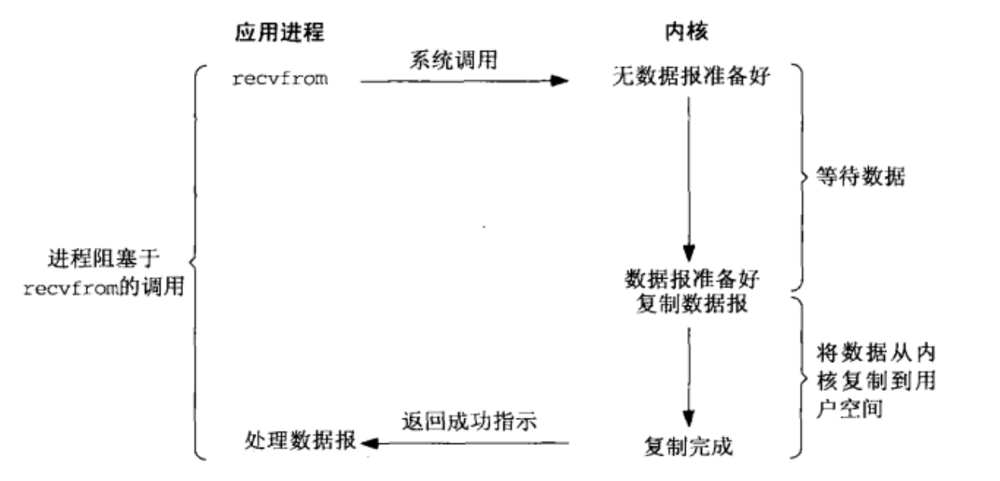
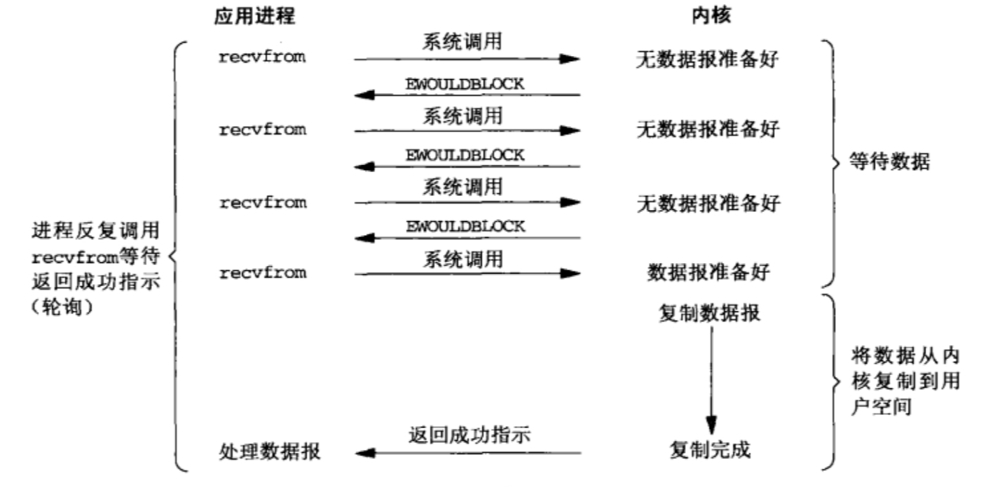
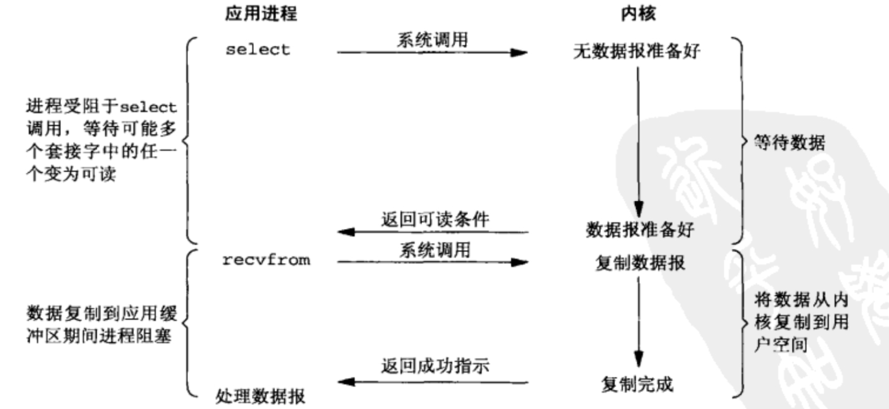
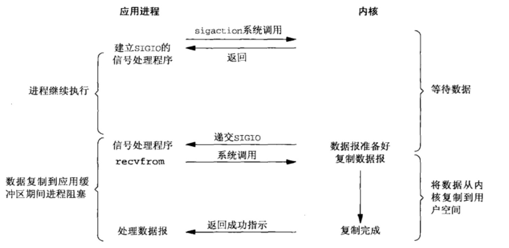

# UNIX Network Programming—Chapter 06 IO复用：`select`和`poll`函数

## 1. 概述

### 1.1 I/O复用

#### 1.1.1 概念

单线程或单进程同时监测若干个文件描述符是否可以执行I/O的能力

#### 1.1.2 应用场合

+ 处理多个描述符（通常是交互式输入和网络套接字）
+ 一个TCP服务器既要处理监听套接字，又要处理已连接套接字
+ 既要处理TCP又要处理UDP
+ 处理多个服务或者协议

### 1.2 I/O模型

#### 1.2.1 阻塞式I/O

应用程序在发起I/O操作后，需要等待或者轮询内核I/O操作完成后才能继续执行



#### 1.2.2 非阻塞式I/O

应用程序在发起I/O操作后可以立即返回，然后应用程序需要不断地发起I/O请求，直到数据到达后，才真正读取到数据，继续执行



#### 1.2.3 I/O复用

在一个线程内注册所关注的socket或I/O请求，使应用程序能够同时处理多个I/O请求。通过这种方式，程序可以在等待数据到达时执行其他任务，从而提高了效率和响应速度



#### 1.2.4 信号驱动式I/O

应用程序发起I/O操作并立即返回，继续执行，当I/O操作真正完成时，应用程序会收到一个信号



## 2. `select`函数

### 2.1 功能

监视多个文件描述符的I/O状态

### 2.2 函数原型

```C
#include <time.h>

struct timeval
{
    long tv_sec;  /* seconds */
    long tv_usec; /* microseconds */
};
```

```C
#include <sys/select.h>

// 若有就绪描述符则为其数目，若超时则为0，若出错则为-1
int select(int maxfdp1, fd_set *readset, fd_set *writeset, fd_set *exceptset, struct timeval *timeout);
```

### 2.3 函数参数

#### 2.3.1 参数`maxfdp1`

三个描述符集中最大描述符编号加1

#### 2.3.2 `timeout` 参数

`timeout` 参数定义了等待时间，有三种可能的值：

+ **无限等待**：设为 `NULL`，直到有描述符准备好
+ **限时等待**：设定一个 `timeval` 结构的时间，返回时至少有一个描述符准备好，但不超过设定时间
+ **无等待**：设为0，即不等待

### 2.4 `fd_set`操作宏

```C
void FD_ZERO(fd_set *set);         // 清空集合中的文件描述符,将每一位都设置为0
void FD_SET(int fd, fd_set *set);  // 添加一个文件描述符，将set中的某一位设置成1
void FD_CLR(int fd, fd_set *set);  // 清除某一个被监视的文件描述符
int FD_ISSET(int fd, fd_set *set); // 测试一个文件描述符是否是集合中的一员
```

## 3. `shutdown`函数

### 3.1 功能

关闭套接字（无论描述符引用计数值为多少，都可以触发TCP的正常连接终止序列）

### 3.2 函数原型

```C
#include <sys/select.h>

// 成功返回0，出错返回-1
int shutdown(int sockfd, int howto);
```

### 3.3 参数`howto`

+ `SHUT_RD`：断开输入流。套接字无法接收数据（即使输入缓冲区收到数据也被抹去），无法调用输入相关函数
+ `SHUT_WR`：断开输出流。套接字无法发送数据，但如果输出缓冲区中还有未传输的数据，则将传递到目标主机
+ `SHUT_RDWR`：同时断开I/O流。相当于分两次调用`shutdown`，其中一次以`SHUT_RD`为参数，另一次以`SHUT_WR`为参数

### 3.4 与`close`区别

+ `shutdown`可以单独关闭套接字的输入或输出，而`close`则会同时关闭两者

+ `close`只有在套接字的引用计数变为0时才会关闭套接字，而`shutdown`则无此限制

## 4. `pselect`函数

### 4.1 功能

监视多个文件描述符的I/O状态

### 4.2 函数原型

```C
#include <time.h>

struct timespec
{
    time_t tv_sec; /* seconds */
    long tv_nsec;  /* nanoseconds */
};
```

```C
#include <sys/select.h>

// 若有就绪描述符则为其数目，若超时则为0，若出错则为-1
int pselect(int maxfdp1, fd_set *readset, fd_set *writeset, fd_set *exceptset,
            const struct timespec *timeout, const sigset_t *sigmask);
```

### 4.3 参数`sigmask`

`sigmask`用于在`pselect`执行期间阻止特定信号的递交，避免信号丢失。相当于内核原子性地执行以下系统调用：

```C
sigset_t sigsaved;
sigprocmask(SIG_SETMASK, &sigmask, &sigsaved);
ready = select(nfds, &readfds, &writefds, &exceptfds, timeout);
sigprocmask(SIG_SETMASK, &sigsaved, NULL);
```

## 5. `poll`函数

### 5.1 功能

监视和等待多个文件描述符的属性变化

### 5.2 函数原型

```C
#include <poll.h>

// 若有就绪描述符则为其数目，若超时则为0，若出错则为-1
int poll(struct pollfd *fdarray, unsigned long nfds, int timeout); // timeout单位：毫秒
```

### 5.3 结构体`pollfd`

```C
struct pollfd
{
    int fd;        // 文件描述符
    short events;  // 等待的事件
    short revents; // 实际发生的事件
};
```

|     常值     | 能否作为events | 能否作为revents |           说明           |
| :----------: | :------------: | :-------------: | :----------------------: |
|   `POLLIN`   |    &#10004;    |    &#10004;     |  普通或优先级带数据可读  |
| `POLLRDNORM` |    &#10004;    |    &#10004;     |       普通数据可读       |
| `POLLRDBAND` |    &#10004;    |    &#10004;     |     优先级带数据可读     |
|  `POLLPRI`   |    &#10004;    |    &#10004;     |     高优先级数据可读     |
|  `POLLOUT`   |    &#10004;    |    &#10004;     |       普通数据可写       |
| `POLLWRNORM` |    &#10004;    |    &#10004;     |       普通数据可写       |
| `POLLWRBAND` |    &#10004;    |    &#10004;     |     优先级带数据可写     |
|  `POLLERR`   |    &#10006;    |    &#10004;     |         发生错误         |
|  `POLLHUP`   |    &#10006;    |    &#10004;     |         发生挂起         |
|  `POLLNVAL`  |    &#10006;    |    &#10004;     | 描述符不是一个打开的文件 |

