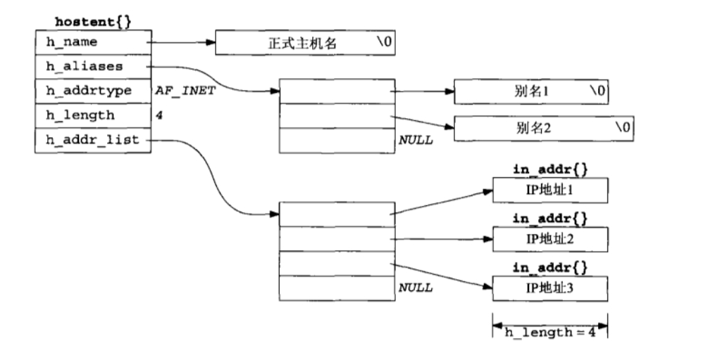

# UNIX Network Programming—Chapter 11 名字与地址转换

## 1. `gethostbyname`函数

### 1.1 功能

根据主机名获取对应的IP地址信息

### 1.2 `hostent`结构体

```C
struct hostent // host entry
{
    char  *h_name;      // 正式主机名
    char **h_aliases;   // 主机别名
    int    h_addrtype;  // 主机IP地址类型：IPV4-AF_INET
    int    h_length;    // 主机IP地址字节长度，对于IPv4是四字节，即32位
    char **h_addr_list; // 主机的IP地址列表
};
```



### 1.3 函数原型

```C
#include <netdb.h>

struct hostent *gethostbyname(const char *hostname); // 成功返回非空指针，出错返回NULL且置h_errno
```

### 1.4 `h_errno`

```C
#include <netdb.h>

extern int h_errno;

char *hstrerror(int err);
```

`h_errno`常值：

|        值        |                      含义                      |
| :--------------: | :--------------------------------------------: |
| `HOST_NOT_FOUND` |                 无法识别主机名                 |
|   `TRY_AGAIN`    |      服务器暂时无法处理请求，稍后可能成功      |
|  `NO_RECOVERY`   | 发生了不可恢复的错误，例如服务器的数据文件损坏 |
|    `NO_DATA`     |     请求的主机名有效，但没有与之关联的数据     |

### 1.5 缺点

+ 只能处理IPv4地址
+ 线程不安全

## 2. `gethostbyaddr`函数

### 2.1 功能

根据IP地址获取主机信息

### 2.2 函数原型

```C
#include <netdb.h>

// 成功返回非空指针，出错返回NULL且置h_errno
struct hostent *gethostbyaddr(const char *addr, socklen_t len, int family);
```

### 2.3 参数`addr`

指向含有IPv4或IPv6地址的结构`in_addr`或`in6_addr`，使用时需要**强制类型转化**

```C
struct in_addr addr;
inet_pton(AF_INET, "127.0.0.1", &addr);
struct hostent *hptr = gethostbyaddr(&addr, sizeof(addr), AF_INET);
```

### 2.4 缺点

+ 只能处理IPv4地址
+ 线程不安全

## 3. `getservbyname`函数

### 3.1 功能

根据**服务名称**和协议获取**服务信息**

### 3.2 `servent`结构体

```C
struct servent // service entry
{
    char   *s_name;    // 正规的服务名
    char  **s_aliases; // 服务别名列表
    int     s_port;    // 端口号
    char   *s_proto;   // 使用的协议
};
```

### 3.3 函数原型

```C
#include <netdb.h>

struct servent *getservbyname(const char *servname, const char *protoname); // 成功返回非空指针，出错返回NULL
```

### 3.4 参数

字符串参数的名称应参照`/etc/services`文件

### 3.5 使用示例

```C
struct servent *sptr;

sptr = getservbyname("domain", "udp"); /* DNS using UDP */
sptr = getservbyname("ftp", "tcp");    /* FTP using TCP */
sptr = getservbyname("ftp", NULL);     /* FTP using TCP */
sptr = getservbyname("ftp", "udp");    /* this call will fail */
```

## 4. `getservbyport`函数

### 4.1 功能

根据端口号和协议获取服务信息

### 4.2 函数原型

```C
#include <netdb.h>

struct servent *getservbyport(int port, const char *protoname); // 成功返回非空指针，出错返回NULL
```

### 4.3 参数`port`

`port`参数的值必须为**网络字节序**

### 4.4 使用示例

```C
struct servent *sptr;

sptr = getservbyport(htons(53), "udp"); /* DNS using UDP */
sptr = getservbyport(htons(21), "tcp"); /* FTP using TCP */
sptr = getservbyport(htons(21), NULL);  /* FTP using TCP */
sptr = getservbyport(htons(21), "udp"); /* this call will fail */
```

## 5. `getaddrinfo`函数

### 5.1 功能

将主机名和服务名解析为相应的套接字地址结构

### 5.2 `addrinfo`结构体

```C
struct addrinfo
{
    int ai_flags;             /* 输入标志，修改函数行为 */
    int ai_family;            /* 地址族，如AF_INET（IPv4） */
    int ai_socktype;          /* 套接字类型，如SOCK_STREAM（流套接字） */
    int ai_protocol;          /* 协议类型，0表示自动选择 */
    size_t ai_addrlen;        /* ai_addr的长度 */
    char *ai_canonname;       /* 主机的规范名 */
    struct sockaddr *ai_addr; /* 套接字地址 */
    struct addrinfo *ai_next; /* 下一个addrinfo结构 */
};
```

### 5.3 函数原型

```C
#include <netdb.h>

int getaddrinfo(const char *hostname, const char *service, const struct addrinfo *hints,
                struct addrinfo **result); // 成功返回0，出错返回非0
```

### 5.4 参数`hostname`

主机名或地址串*（IPv4的点分十进制串或IPv6的十六进制数串）*

### 5.5 参数`service`

服务名或十进制端口号数串

### 5.6 参数`hints`

`hints`参数是一个指向`addrinfo`结构的指针，用于指定期望`getaddrinfo`函数返回的地址信息的类型。

+ `NULL`：如果`hints`参数为`NULL`，函数将返回所有类型的地址信息，包括不同的地址族（如IPv4和IPv6），不同的套接字类型（如流套接字和数据报套接字），以及不同的协议类型（如TCP和UDP）
+ 非`NULL`：如果`hints`参数非`NULL`，调用者可以设置的成员如下
    + `ai_flags`：输入标志，用于修改函数的行为。例如：
        + `AI_PASSIVE`：套接字将用于监听
        + `AI_CANONNAME`：请求返回规范名
        + `AI_NUMERICHOST`：`hostname`必须是数字地址字符串
        + `AI_NUMERICSERV`：`service`必须是数字端口号
        + `AI_V4MAPPED`：如果没有找到IPv6地址，则返回映射到IPv6格式的IPv4地址
        + `AI_ALL`：在IPv6地址后面返回IPv4地址
        + `AI_ADDRCONFIG`：只返回与系统配置的地址类型相对应的地址
    + `ai_family`：地址族，例如`AF_INET`表示IPv4，`AF_INET6`表示IPv6，`AF_UNSPEC`表示任何地址族
    + `ai_socktype`：套接字类型，例如`SOCK_STREAM`表示流套接字，`SOCK_DGRAM`表示数据报套接字
    + `ai_protocol`：协议类型，通常为0，表示自动选择，或者为`IPPROTO_TCP`（TCP协议）或`IPPROTO_UDP`（UDP协议）

### 5.7 返回值

|      常值      |                   说明                    |
| :------------: | :---------------------------------------: |
|  `EAI_AGAIN`   |            名字解析中临时失败             |
| `EAI_BADFLAGS` |            `ai_flags`的值无效             |
|   `EAI_FAIL`   |         名字解析中不可恢复地失败          |
|  `EAI_FAMILY`  |             不支持`ai_family`             |
|  `EAI_MEMORY`  |               内存分配失败                |
|  `EAI_NONAME`  |  `hostname`或`service`未提供，或者不可知  |
| `EAI_OVERFLOW` | 用户参数缓冲区溢出*（仅限`getnameinfo`）* |
| `EAI_SERVICE`  |    不支持`ai_socktype`类型的`service`     |
| `EAI_SOCKTYPE` |            不支持`ai_socktype`            |
|  `EAI_SYSTEM`  |       在`errno`变量中有系统错误返回       |

## 6. `gai_strerror`函数

### 6.1 功能

返回`getaddrinfo`或`getnameinfo`函数错误值的描述字符串

### 6.2 函数原型

```C
#include <netdb.h>

const char *gai_strerror(int error); // 返回指向错误描述消息字符串的指针
```

## 7. `freeaddrinfo`函数

### 7.1 功能

释放`getaddrinfo`函数动态分配的`addrinfo`结构

### 7.2 函数原型

```C
#include <netdb.h>

void freeaddrinfo(struct addrinfo *ai);
```

## 8. `getnameinfo`函数

### 8.1 功能

将套接字地址结构转换为主机名和服务名

### 8.2 函数原型

```C
#include <netdb.h>

int getnameinfo(
    const struct sockaddr *addr, socklen_t addrlen,
    char *host, socklen_t hostlen,
    char *serv, socklen_t servlen, int flags); // 成功返回0，出错返回非0
```

### 8.3 主机名参数：`host`和`hostlen`

如果不需要请求主机名，可以通过设置`host`参数为`NULL`或者`hostlen`参数为`0`来实现

### 8.4 服务名参数：`serv`和`servlen`

如果不需要请求服务名，可以通过设置`serv`参数为`NULL`或者`servlen`参数为`0`来实现

### 8.5 参数`flags`

|       常值        |               说明               |
| :---------------: | :------------------------------: |
|    `NI_DGRAM`     |            数据报服务            |
|   `NI_NAMEREQD`   | 若不能从地址解析出名字则返回错误 |
|    `NI_NOFQDN`    |      只返回FQDN的主机名部分      |
| `NI_NUMERICHOST`  |     以数串格式返回主机字符串     |
| `NI_NUMERICSCOPE` |   以数串格式返回范围标识字符串   |
| `NI_NUMERICSERV`  |     以数串格式返回服务字符串     |
